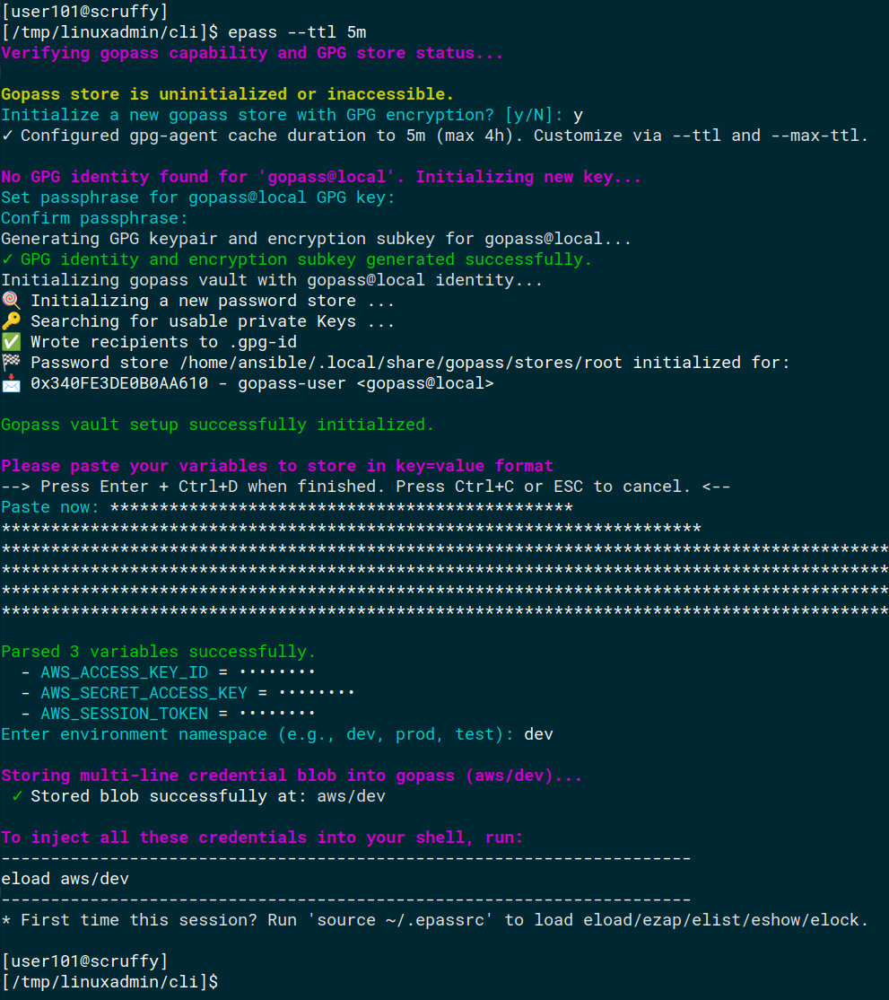
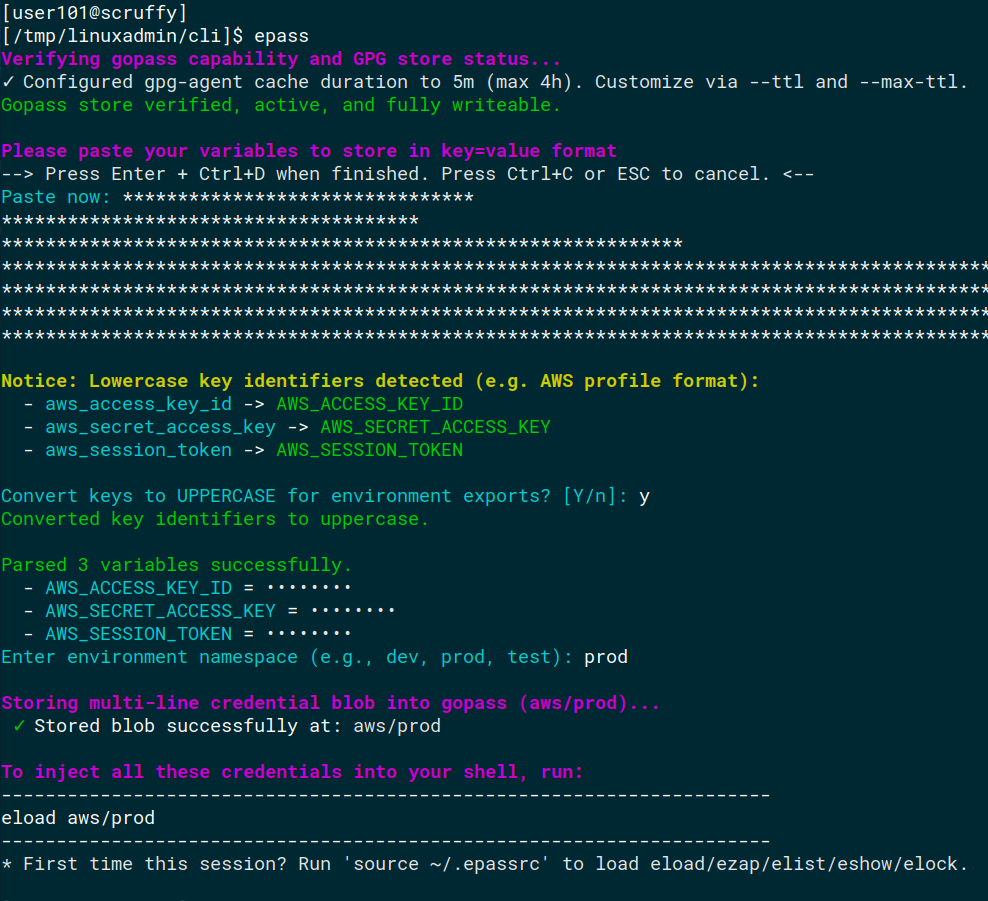
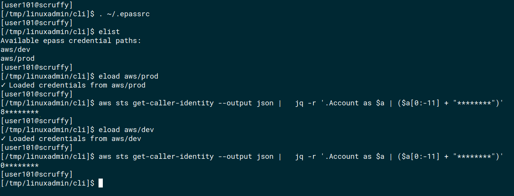

# epass

A python wrapper for [[gopass](https://github.com/gopasspw/gopass)]
(Claude was leveraged for much of the development)

| In Use | Still Tuning |
|--------|--------------|
| ✅     | ✅           |

epass is an environment and secret management utility intended for use within interactive containerized workflows, especially in environments where AI tools are present. Working as a wrapper around gopass, epass will run a first-time init of gopass using GnuPG as the encryption. The storage is intended to be ephemeral, so when the container closes, the secrets are gone too. During this first-time init, epass will also offer to install a set of shell helper functions (`eload`, `ezap`, `elist`, `eshow`, `elock`) to `~/.epassrc`, and include in your ~/.bashrc or ~/.zshrc so injecting and clearing credentials in your shell is a single command.

After initialization, you can store a secret by running epass again and you will be prompted for data to store. epass will accept the pasted data as a multi-line blob (such as AWS credentials) and only echo '*' characters via a masked paste operation. This keeps the pasted data out of shell history and terminal scrollback, and unencrypted local files like ~/.aws/credentials.

Since we use GnuPG for the encryption, a default credential timeout of 1 hour is applied (maybe Age will have this one day). This minimizes the amount of time the password store is accessible, and can be tuned at runtime with the --ttl parameter - accepting a bare number of hours, or a value suffixed with s/m/h (e.g. --ttl 30m) for finer control. A separate --max-ttl hard-caps the cache regardless of activity, defaulting to 4 hours.


## shell helpers
| Command | What it does |
|---|---|
| `eload <path>` | Decrypts a stored entry and `eval`s injects it into your current shell's environment.
| `ezap <path>` | Unsets whatever environment variables `eload <path>` had exported. |
| `elist` | Lists all secret paths available in the store. |
| `eshow <path>` | Prints the raw decrypted data to the terminal - this does taint your scrollback so beware |
| `elock` | Reloads gpg-agent, purging the cached passphrase immediately, ahead of the normal `--ttl` expiry. |
| `ehelp` | Prints this list. |


## Initial epass setup - 5 minute key cache



## Adding a second set of credentials



## Injecting into the environment




### Requirements

- Python 3.x
- GnuPG (`gpg`, `gpg-agent`, `gpgconf`)
- `gopass` (The Next-Generation Password Manager binary) [[Github](https://github.com/gopasspw/gopass)]

### Usage

```bash
[user101@scruffy]
[/tmp/linuxadmin/cli]$ epass -h 
usage: epass [-h] [--init] [--reset] [--ttl TTL] [--max-ttl MAX_TTL]

epass: Wrapper for gopass storage and secret loading.

options:
  -h, --help
  --init             Install epass shell helpers into ~/.epassrc. Includes in ~/.bashrc or ~/.zshrc.
  --reset            Wipe gopass stores and remov GPG keys/identity.
  --ttl TTL          Inactivity cache timeout. (default: 1h). Use 's' or 'm' for seconds/minutes: --ttl 45s
  --max-ttl MAX_TTL  Maximum cache timeout. (default: 4h). Use 's' or 'm' for seconds/minutes: --max-ttl 90m

Current Gopass Multi-Line Environment Entries:
----------------------------------------------------------------------
# Load aws/dev:
eload aws/dev

# Load aws/prod:
eload aws/prod

----------------------------------------------------------------------

```
