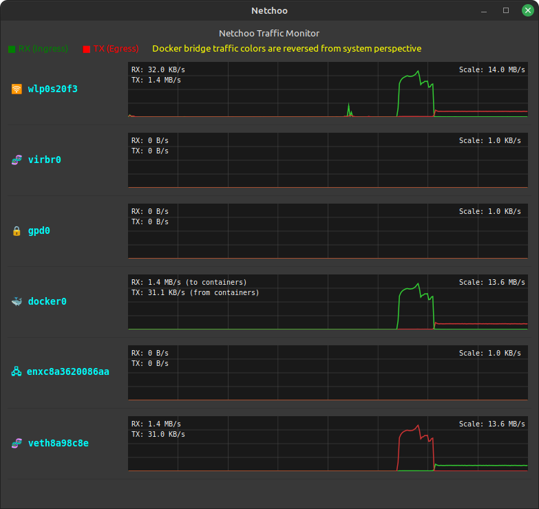

# Netchoo

A real-time network traffic monitoring application written using Python, GTK3 and Claude✨ (mostly Claude), providing visual representation of network interface activity. 

Here we can see Netchoo in action as it downloads a tarball from kernel.org, then uploads it to an s3 bucket for no other reason than to generate a nice graph.



## Features

* Real-time monitoring of network interfaces
* Visual graphs showing RX/TX rates
* Bandwidth format display
* Stretchy window

## Requirements

* Python 3.x
* GTK3+
* PyGObject
* Linux system with procfs support

## Installation

1. Clone the repository:
```bash
git clone https://github.com/z-tb/linuxadmin.git
```
2. Install dependencies:
```bash
sudo apt-get install python3-gi gir1.2-gtk-3.0
```
3. Run the application:
```bash
python3 netchoo.py
```

## Usage

The application provides a graphical interface displaying:
* Active network interfaces
* Real-time RX/TX traffic graphs
* Current bandwidth usage

## Technical Details

* Monitors network interfaces through `/proc/net/dev`
* Updates traffic data every second (configurable via -s)
* 5-minute rolling history window (configurable via -t)
* Stretchy graph scaling

## License

This program is free software: you can redistribute it and/or modify it under the terms of the GNU General Public License as published by the Free Software Foundation, version 3 of the License.

This program is distributed in the hope that it will be useful, but WITHOUT ANY WARRANTY; without even the implied warranty of MERCHANTABILITY or FITNESS FOR A PARTICULAR PURPOSE. See the GNU General Public License for more details.

You should have received a copy of the GNU General Public License along with this program. If not, see <https://www.gnu.org/licenses/>.

